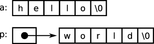

As stated previously, Arrays and Pointers share some properties in a way for which there are some common misconceptions. This part deals with those misconceptions and aims to deepen your knowledge. Those misconceptions and the explanations are parsed from the [linked C FAQ](http://c-faq.com).

As this section is getting too huge, here is a list of contents:
1. [Explanation: Arrays and Pointers](#explanation)
2. [Array ≠ Pointer](#arrNotPtr)
3. [Initialization vs Assignment](#initAssign)
4. [`char a[6]` in one source, `extern char *a` in another is not valid](#arrPtrSrc)
5. [Passing an Array as a Parameter](#passArr)
6. [Accessing `i[arr]` is valid](#accessArr)
7. [Dynamic Arrays](#dynArr)
8. [Dynamic Allocation of Multidimensional Arrays](#dynMultidimArr)
8.1. Allocation
8.2. Freeing
8.3. Three Dimensions
9. Passing 2D Arrays

### <a name="explanation" style="color:black">Eplanation: Arrays and Pointers</a>
An **array** is a single, preallocated chunk of contiguous elements (all of the same type), fixed in size and location.

A **pointer** is a reference to any data element (of a particular type) anywhere. A pointer must be assigned to point to space allocated elsewhere, but it can be reassigned (and the space, if derived from `malloc`, can be resized) at any time.

A pointer can point to an array, and can simulate (along with `malloc`) a dynamically allocated array, but a pointer is a much more general data structure.


### <a name="arrNotPtr" style="color:black">Array ≠ Pointer</a>
Yes, arrays are not pointers and pointers are not arrays. Indeed, you can set `type* ptr = arr` and iterate through the array elements using the same indexes, s.t. both `arr[i]` and `ptr[i]` are valid, but `ptr` ≠ `arr` for the in the following explained reason.

Take the following code partition:
```C
char a[] = "hello";
char *p = "world";
```
This would initialize structures that look like in the following:


The FAQ states:
> The array declaration `char a[6]` requests that space for six characters be set aside, to be known by the name `a`. That is, there is a location named `a` at which six characters can sit. The pointer declaration `char *p`, on the other hand, requests a place which holds a pointer, to be known by the name `p`. This pointer can point almost anywhere: to any char, or to any contiguous array of chars, or nowhere.<sup>[\[1\]](#footn1)</sup>
> 
> It is useful to realize that a reference like `x[3]` generates different code depending on whether `x` is an array or a pointer. Given the declarations above, when the compiler sees the expression `a[3]`, it emits code to start at the location `a`, move three past it, and fetch the character there. When it sees the expression `p[3]`, it emits code to start at the location `p`, fetch the pointer value there, add three to the pointer, and finally fetch the character pointed to. In other words, `a[3]` is three places past (the start of) the object named `a`, while `p[3]` is three places past the object pointed to by `p`.
> In the example above, both `a[3]` and `p[3]` happen to be the character `'l'`, but the compiler gets there differently. (The essential difference is that the values of an array like `a` and a pointer like `p` are computed differently whenever they appear in expressions, whether or not they are being subscripted

!!! NOTE: "Pointer arithmetic and array indexing are equivalent in C, pointers and arrays are _different_" (Wyne Throop)

<a name="footn1">[1]</a>: Don't interpret "anywhere'' and "nowhere'' too broadly. To be valid, a pointer must point to properly allocated memory; to point definitively nowhere, a pointer must be a null pointer.


### <a name="initAssign" style="color:black">Initialization vs Assignment</a>
An array is static sized. Once initialized, one cannot just (re-)assign it in C. This means  when you need to copy the contents of one array to another, you must do so explicitly. In the case of char arrays, the `strcpy` and `memcpy` routines are usually appropriate to do so. However, you are allowed to initialize arrays when you define them, e.g. like this: `char a[] = "Hello, world!\n";`.


### <a name="arrPtrSrc" style="color:black">`char a[6]` in one source, `extern char *a` in another</a>
This will **not** work. In one source file you defined an array of characters and in the other you declared a pointer to characters. The declaration `extern char *a` does not declare an array and therefore does not match the actual definition. The type `pointer-to-type-T` is not the same as `array-of-type-T`. Use `extern char a[]` instead.


### <a name="passArr" style="color:black">Passing an Array as a Parameter</a>
Passing an array to a function as a parameter is not possible strictly seen. The FAQ explains it as follows:

Since arrays decay immediately into pointers, an array is never actually passed to a function. You can pretend that a function receives an array as a parameter, and illustrate it by declaring the corresponding parameter as an array:

```C
void f(char a[]){
  ; // do something
}
```
Interpreted literally, this declaration would have no use, so the compiler turns around and pretends that you'd written a pointer declaration, since that's what the function will in fact receive:

```C
void f(char *a){
  ; // do something
}
```
There's nothing particularly wrong with talking about a function as if it "receives'' an array, if the function is traditionally used to operate on arrays, or if the parameter is naturally treated within the function as an array.

This conversion of array-like declarators into pointers holds only within function formal parameter declarations, nowhere else. If the conversion bothers you, you're under no compulsion to make use of it; many programmers have concluded that the confusion it causes outweighs the small advantage of having the declaration "look like'' the call or the uses within the function. (Note that the conversion happens only once; something like `char a2[][]` won't work.

!!! NOTE: `void f(char a[m][n])` will still work as the sizes are specified before compilation.


### <a name="accessArr" style="color:black">Accessing `i[arr]` is valid</a>
Yes, accessing `i[arr]` instead of `arr[i]` is valid in C as array subscripting is commutative in C<sup>[\[2\]](#footn2)</sup>. This curious fact follows from the pointer definition of array subscripting, namely that `a[e]` is identical to `*((a)+(e))`, for _any_ two expressions `a` and `e`, as long as one of them is a pointer expression and one is integral. The "proof'' looks like:
```C
	a[e]
	<=> *((a) + (e))	// by definition
	<=> *((e) + (a))	// by commutativity of + in (ℤ, +, *)
	<=> e[a]		    // by definition
 ```
This unsuspected commutativity is often mentioned in C texts as if it were something to be proud of, but it finds no useful application outside of the Obfuscated C Contest.

<a name="footn2">[2]</a>:The commutativity is of the array-subscripting operator `[]` itself; obviously `a[i][j]` is in general different from `a[j][i]`.


### <a name="dynArr" style="color:black">Dynamic Arrays</a>
It is also possible to set an array's size dynamically at runtime as the equivalence between arrays and pointers (see question 6.3) allows a pointer to `malloc`ed memory to simulate an array quite effectively. Let us look at the following code:

```C
#include <stdlib.h>
int main(){
  int *dynarray;
  dynarray = malloc(10 * sizeof(int));
  // do something
  return 0;
}
```
you can reference `dynarray[i]` (for `i` from 0 to 9) almost as if `dynarray` were a conventional, statically-allocated array `int a[10]`. The only difference is that `sizeof` will not give the size of the "array''.

!!! NOTE: With C99, it is also possible to set an array's size at runtime with a variable, e.g. `int arr[n]` for an `n`. This is called a "variable length array" (VLA).


### <a name="dynMultidimArr">Dynamic Allocation of Multidimensional Arrays</a>
This part is wholly copied and edited / reformatted from the previously linked FAQ.

#### Allocation
The traditional solution is to allocate an array<sup><a href="#footn3">[3]</a></sup> of pointers to pointers, and then initialize each pointer to a dynamically-allocated "row.'' Here is a two-dimensional example:

```C
#include <stdlib.h>

int main(){
  int **array1 = malloc(nrows * sizeof(int *));
  for(i = 0; i < nrows; i++)
    array1[i] = malloc(ncolumns * sizeof(int));
  return 0;
}
```
In real code, of course, all of `malloc`'s return values would be checked. You can also use `sizeof(*array1)` and `sizeof(**array1)` instead of `sizeof(int *)` and `sizeof(int)`; see the footnote<sup><a href="#footn4">[4]</a></sup> .

You can keep the array's contents contiguous, at the cost of making later reallocation of individual rows more difficult, with a bit of explicit pointer arithmetic:
```C
int **array2 = malloc(nrows * sizeof(int *));
array2[0] = malloc(nrows * ncolumns * sizeof(int));

for(i = 1; i < nrows; i++)
  array2[i] = array2[0] + i * ncolumns;
```
In either case (i.e for array1 or array2), the elements of the dynamic array can be accessed with normal-looking array subscripts: `arrayx[i][j]` (for `0 ≤ i < nrows` and `0 ≤ j < n` columns). Here is a schematic illustration of the layout of array1 and array2: 


If the double indirection implied by the above schemes is for some reason unacceptable<sup><a href="#footn5">[5]</a></sup>, you can simulate a two-dimensional array with a single, dynamically-allocated one-dimensional array:

```C
int *array3 = malloc(nrows * ncolumns * sizeof(int));
```

However, you must now perform subscript calculations manually, accessing the `i,j`-th element with the expression:
```C
array3[i * ncolumns + j];
```
and this array cannot necessarily be passed to functions which expect multidimensional arrays. A macro such as `#define Arrayaccess(a, i, j) ((a)[(i) * ncolumns + (j)])` could hide the explicit calculation, but invoking it would require parentheses and commas which wouldn't look exactly like conventional C multidimensional array syntax, and the macro would need access to at least one of the dimensions, as well.

Yet another option is to use pointers to arrays:
```C
int (*array4)[NCOLUMNS] = malloc(nrows * sizeof(*array4));
```
or even
```C
int (*array5)[NROWS][NCOLUMNS] = malloc(sizeof(*array5));
```
but the syntax starts getting horrific as accesses to `array5` look like `(*array5)[i][j]`, and at most one dimension may be specified at run time.

<a name="footn3">[3]</a>: Strictly speaking, these aren't arrays, but rather objects to be used like arrays.

<a name="footn4">[4]</a>: Any time you're allocating space for a pointer p to point to, it can be a good idea to use the idiom `p = malloc(n * sizeof(*p))` rather than the more obvious `p = malloc(n * sizeof(int))`, where of course the type we need the size of isn't necessarily int, but rather whatever type it is that p points to<sup><a href="#footn41">[4.1]</a></sup>. The reason is that the code is more self-contained, more self-documenting, and more robust: a reader looking at this way.

Using `p = malloc(n * sizeof(*p))` one can see immediately that the correct amount of space is being allocated, without looking back at `p`'s declaration to see what type it is. If `p`'s type ever changes, the `malloc` call may not have to change. 

The `sizeof(p)` form can also be seen in the `array4` and `array5` examples.

<a name="footn41">[4.1]</a>: In fact, the language I've had to use in this parenthetical provides another argument in favor of the `sizeof(*p)` form: the English construction "the type we need the size of... is whatever type it is that `p` points to'' describes precisely the same notion that the C construction `sizeof(*p)` succinctly captures.

<a name="footn5">[5]</a>: Note however that double indirection is not necessarily any less efficient than multiplicative indexing.


#### Freeing
With all of these techniques, you may of course need to remember to `free` the arrays when they are no longer needed. In the case of `array1` and `array2` this takes several steps:

```C
for(i = 0; i < nrows; i++)
  free((void *)array1[i]);
free((void *)array1);

free((void *)array2[0]);
free((void *)array2);
```
Also, you cannot necessarily intermix dynamically-allocated arrays with conventional, statically-allocated ones.


#### Three Dimensions
All of these techniques can also be extended to three or more dimensions. Here is a three-dimensional version of the first technique (which, like the rest of the fragments presented here, requires error-checking before being used in a real program):

```C
int ***a3d = (int ***)malloc(xdim * sizeof(int **));
for(i = 0; i < xdim; i++) {
  a3d[i] = (int **)malloc(ydim * sizeof(int *));
  for(j = 0; j < ydim; j++)
    a3d[i][j] = (int *)malloc(zdim * sizeof(int));
}
```