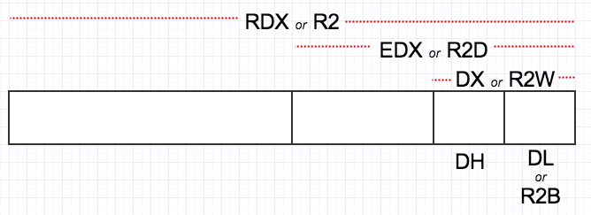

The main tools to write programs in x86 assembly are the processor registers. The registers are like variables built in the processor. Using registers instead of memory to store values makes the process faster and cleaner. Note that the rules described here are more suggestions than strict rules. Some operations need absolutely some kind of registers but most of them you can use freely. This freedom however may be limited when if you are linking your code with another programming language since then the conventions of the compiler you are using may apply.

Note that this tutorial mainly deals with x86 registers, so some x64 registers will be mentioned partly only. Also, this page is meant to give a general overview on the important registers, so some registers might not be included. Some CPU families might even have added some extra registers not mentioned here.


## Overview
Here is a list of the available registers on the i386 and higher processors. This list shows the 32 bit registers. Most of them can be broken down to 16 or even 8 bits register.

|General registers| Segment registers | Index and pointers | Indicator |
|-------------------------|
|EAX EBX ECX EDX| CS DS ES FS GS SS | ESI EDI EBP EIP ESP | EFLAGS |


## General Registers
As the title says, general register are the one we use most of the time Most of the instructions perform on these registers. They all can be broken down into 16 and 8 bit registers. Note that the 64-bit parts can solely be accessed with 64-bit CPUs.

|64-bit|32-bit|16-bit|8-bit high|8-bit low|
|--------------------------------------------|
|RAX     |EAX     |AX        |AH        |AL      |
|RBX|EBX|BX|BH|BL|
|RCX|ECX|CX|CH|CL|
|RDX|EDX|DX|DH|DL|

The "H" and "L" suffix on the 8 bit registers stand for high byte and low byte. The following picture taken from the NASM tutorial by Ray Toe may help understanding it better:


With this out of the way, let's see their individual main use

| Registers | Designation | Usage |
|-----------------------|
| EAX,AX,AH,AL | The Accumulator register | It is used for I/O port access, arithmetic, interrupt calls, etc... |
| EBX,BX,BH,BL | The Base register | It is used as a base pointer for memory access. Gets some interrupt return values |
| ECX,CX,CH,CL | The Counter register | It is used as a loop counter and for shifts. Gets some interrupt values |
| EDX,DX,DH,DL | Called the Data register | It is used for I/O port access, arithmetic, some interrupt calls |

!!! NOTE: wiriting on `Exx` register will overwrite the higher 32-bit with 0 in x64 processors, but writing on the 16-bit or 8-bit parts will not overwrite anything else than that specific part itself.

The previous note can be explained by the following code:
```nasm

mov eax, 0xFFFFFFFF		; EAX = 0xFFFFFFFF (RAX = 0x00000000FFFFFFFF)
mov ax, 0x1111			; EAX = 0xFFFF1111
mov al, 0xFF			; EAX = 0xFFFF11FF

; alternative to above code:
mov eax, 0xFFFFFFFF		; EAX = 0xFFFFFFFF
mov ah, 0x11			; EAX = 0xFFFF11FF
```

## Segment Registers

Segment registers hold the segment address of various items. They are only available in 16 values. They can only be set by a general register or special instructions. Some of them are critical for the good execution of the program and you might want to consider playing with them when you'll be ready for multi-segment programming

|Register|Usage|Warning|
|------------------------------|
|CS  | Holds the Code segment in which your program runs| Changing its value might make the computer hang |
|DS  | Holds the Data segment that your program accesses| Changing its value might give erronous data |
|ES,FS,GS | These are extra segment registers available for far pointer addressing like video memory and such| |
|SS |Holds the Stack segment your program uses. Sometimes has the same value as DS| Changing its value can give unpredictable results, mostly data related |


## Indexes and Pointers

Indexes and pointer and the offset part of and address. They have various uses but each register has a specific function. They some time used with a segment register to point to far address (in a 1Mb range).

| Register | Designation | Usage | Warning |
|---------------------------------------------------|
|ES:EDI EDI DI | Destination index register | Used for string, memory array copying and setting and for far pointer addressing with ES | |
| DS:ESI EDI SI | Source index register | Used for string and memory array copying | |
| SS:EBP EBP BP | Stack Base pointer register | Holds the base address of the stack | |
| SS:ESP ESP SP | Stack pointer register | Holds the top address of the stack | |
| CS:EIP EIP IP | Index Pointer | Holds the offset of the next instruction | It can only be read |

!!! NOTE: In x64, you may use RDI, RSI, RBP, RSP and RIP registers.

## The EFLAGS Register

The EFLAGS register holds the state of the processor. It is modified by many intructions and is used for comparing some parameters, conditional loops and conditionnal jumps. Each bit holds the state of specific parameter of the last instruction. Here is a listing :

**Note: in x64 Assembly, this register is called `RFLAGS`**


|Bit |  Label |   Desciption | Usage | Category |
|---------------------------|
| **FLAGS** |
|0   |   CF |     Carry flag | Set if the last arithmetic operation carried (addition) or borrowed (subtraction) a bit beyond the size of the register. This is then checked when the operation is followed with an add-with-carry or subtract-with-borrow to deal with values too large for just one register to contain | Status |
|1 |            | Reserved | Always 1 in EFLAGS  |   |
|2   |   PF  |    Parity flag | Set if the number of set bits in the least significant byte is a multiple of 2 | Status |
|3    |          |  Reserved |   |  |
|4    |  AF   |   Auxiliary carry flag | Carry of Binary Code Decimal (BCD) numbers arithmetic operations | Status |
|5    |          |  Reserved |   |  |
|6   |   ZF    |  Zero flag | Set if the result of an operation is Zero (0) | Status |
|7    |  SF |     Sign flag | Set if the result of an operation is negative | Status |
|8  |    TF  |    Trap flag | Set if step by step debugging | Control  |
|9   |   IF     | Interrupt enable flag | Set if interrupts are enabled | Control  |
|10  |   DF |     Direction flag (stream direction) | If set, string operations will decrement their pointer rather than incrementing it, reading memory backwards | Control  |
|11   |  OF  |    Overflow flag | Set if signed arithmetic operations result in a value too large for the register to contain | Status |
|12 - 13 | IOPL|    I/O Priviledge level | I/O Privilege Level of the current process | System |
|14  |   NT   |   Nested task flag | Controls chaining of interrupts. Set if the current process is linked to the next process | System |
| 15 |           | Reserved | Always 1 on 8086 and 186, always 0 on later models |  |
| **EFLAGS** |
|16  |   RF    |  Resume flag | Response to debug exceptions | System |
|17   |  VM  |  Virtual 8086 mode flag | Set if in 8086 compatibility mode | System |
|18  |   AC   |   Alignment check flag (486+) | Set if alignment checking of memory references is done | System |
|19   |  VIF |    Virutal interrupt flag | Virtual image of IF | System |
|20  |   VIP  |   Virtual interrupt pending flag | Set if an interrupt is pending | System |
|21   |  ID   |   ID flag | Support for CPUID instruction if can be set | System |
|22   |  ID   |   ID flag | Support for CPUID instruction if can be set |  System |
| 23 - 31 | VAD | VAD Flag |  | System |
| **RFLAGS** |
| 32 - 63 |  | Reserved |  |  |


## Floating Points
The x86_64 architecture comes with an x87 Floating Point Unit (FPU) which can make use of 8 registers and some floating point instructions.
The registers are called from `st0` to `st7` and are each 80-bit long while they may preserve 32-bit or 64-bit values (`float` and `double` in C).
FPU instructions generally will pop the first two items off the stack, act on them, and push the answer back on to the top of the stack.

### FPU Instructions (in NASM)
The following table shows some basic instructions for the FPU. Note that this is not a full instruction list.

| Instruction | Designation | Use | Description |
|-------------------------|
|fld| load float | `fld qword [var]` | load value of `var` into st0 |
| fst | store float | `fst qword [result]` | store value of st0 in `result` |
| fadd | add float | `fadd st1, st0` | st1 = st1 + st0 |
| fsub | sub float | `fsub st1, st0` | st1 = st1 - st0 |
| fmul | mul floats | `fmul qword [var]`, `fmul st0, st1` | st0 = st0 * var, st0 = st0 * st1 |
| fdiv | div floats | `fdiv qword [var]`, `fdiv sto, st1` | st0 = st0 / var, st0 = st0 / st1 |
| fsqrt | sqrt | `fsqrt` | sqrt of st0 |
| fcos | cosinus | `fcos` | cosinus of st0 |
| fsin | sinus | `fsin` | sinus of st0 |

!!! NOTE: `fcos` and `fsin` are not part of the original x87 Instruction Set, but are rather an 80387 (i387) extension to the x87 instructions.
For more on this, read [X86 Assembly/Floating Point](https://en.wikibooks.org/wiki/X86_Assembly/Floating_Point).


## Undocumented registers

There are registers on the 80386 and higher processors that are not well documented by Intel. These are divided in control registers, debug registers, test registers and protected mode segmentation registers. AFAIK, the control registers, along with the segmentation registers, are used in protected mode programming, all of these registers are available on 80386 and higher processors except the test registers that have been removed on the pentium. Control registers are CR0 to CR4, Debug registers are DR0 to DR7, test registers are TR3 to TR7 and the protected mode segmentation registers are GDTR (Global Descriptor Table Register), IDTR (Interrupt Descriptor Table Register), LDTR (Local DTR), and TR.


## x64 registers
The x64 architecture came not only with a 64-bit extension of the existing 32-bit registers, but also with a newer set of registers. Those newer registers are as follwoing:

| 64-bit | 32-bit | 16-bit | 8-bit |
|---------------------------------------|
| r8 | r8d | r8w | r8b |
| r9 | r9d | r9w | r9b |
| r10 | r10d | r10w | r10b |
| r11 | r11d | r11w | r11b |
| r12 | r12d | r12w | r12b |
| r13 | r13d | r13w | r13b |
| r14 | r14d | r14w | r14b |
| r15 | r15d | r15w | r15b |


## x64 C/++ Calling Convention

* The first four integer or pointer parameters are passed in the `rcx, rdx, r8, and r9` registers.
* The first four floating-point parameters are passed in the first four SSE registers, `xmm0, xmm1, xmm2, xmm3`.
* The caller reserves space on the stack for arguments passed in registers. The called function can use this space to spill the contents of registers to the stack.
* Any additional arguments are passed on the stack.
* An integer or pointer return value is returned in the rax register, while a floating-point return value is returned in `xmm0`.
* `rax, rcx, rdx, r8-r11` are volatile.
* `rbx, rbp, rdi, rsi, r12-r15` are nonvolatile.

!!! NOTE: The `xmm0` to `xmm7` registers are 128-bit wide each and are part of the Streaming SIMD Extension (SSE).


## Comments
You may leave comments and/or suggestions here.
{{ jscomments()|raw }}
