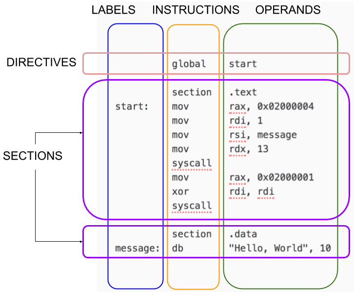

!!! NOTE: This page mainly consists of elements from the NASM Tutorial by Ray Toe. See [Resources](../../resources) section for the direct link to the source.

## Structure of a NASM Program

NASM is line-based. Most programs consist of directives followed by one or more sections. Lines can have an optional label. Most lines have an instruction followed by zero or more operands.



Generally, you put code in a section called `.text`, your constant data in a section called `.data` and reserved space (for data yet to be initialized) into the `bss` segment / section.

!!! NOTE: Any label may be up to 4095 characters of size. NASM does not support any labels longer than that.

## Your First Few Instructions

There are hundreds of instructions. You can’t learn them all at once. Just start with these:
```nasm
mov x, y	; x ← y
and x, y	; x ← x and y
or x, y		; x ← x or y
xor x, y	; x ← x xor y
add x, y	; x ← x + y
sub x, y	; x ← x – y
inc x		; x ← x + 1
dec x		; x ← x – 1
syscall		; Invoke an operating system routine
db			; A pseudo-instruction that declares bytes that will be in memory when the program runs 
```
Also see the explanation on [pseudo-instructions](https://www.nasm.us/xdoc/2.11.02/html/nasmdoc3.html#section-3.2).


## Memory Operands

These are the basic forms of addressing:

```nasm
    [ number ]
    [ reg ]
    [ reg + reg*scale ]      ; scale is 1, 2, 4, or 8 only
    [ reg + number ]
    [ reg + reg*scale + number ]
```

The number is called the **displacement**; the plain register is called the **base**; the **register** with the scale is called the index.

Examples:

```nasm
    [750]                  ; displacement only
    [rbp]                  ; base register only
    [rcx + rsi*4]          ; base + index * scale
    [rbp + rdx]            ; scale is 1
    [rbx - 8]              ; displacement is -8
    [rax + rdi*8 + 500]    ; all four components
    [rbx + counter]        ; uses the address of the variable 'counter' as the displacement
```


## Immediate Operands

These can be written in many ways. Here are some examples from the official docs:
```nasm
200          ; decimal
0200         ; still decimal - the leading 0 does not make it octal
0200d        ; explicitly decimal - d suffix
0d200        ; also decimal - 0d prefix
0c8h         ; hex - h suffix, but leading 0 is required because c8h looks like a var
0xc8         ; hex - the classic 0x prefix
0hc8         ; hex - for some reason NASM likes 0h
310q         ; octal - q suffix
0q310        ; octal - 0q prefix
11001000b    ; binary - b suffix
0b1100_1000  ; binary - 0b prefix, and by the way, underscores are allowed
```


The sections following this will deal with more details on the NASM syntax and optimization advices.


## Comments
You may leave comments and/or suggestions here.
{{ jscomments()|raw }}